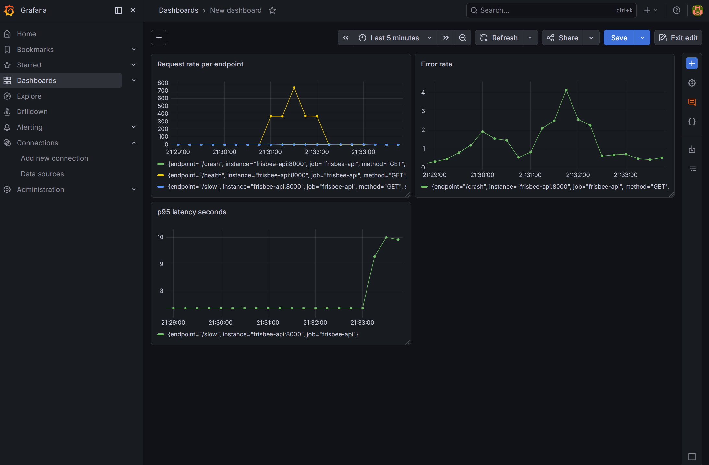

# Frisbee SRE

A production-grade observability lab built to demonstrate failure 
detection, incident response, and system recovery — using a 
match-tracking API as the workload.

## What this project demonstrates
- Containerising and deploying a Python API to Kubernetes
- Instrumenting an app with Prometheus metrics (counters, histograms)
- Visualising request rate, error rate, and p95 latency in Grafana
- Debugging real incidents: OOMKilled pods, latency spikes, 
  self-healing behaviour
- Production Kubernetes patterns: liveness probes, resource limits, 
  rolling updates, persistent storage

## Architecture

[ Client ] → [ FastAPI on port 30000 ]
                     ↓
            [ Kubernetes Cluster ]
            ├── frisbee-api (2 replicas)
            ├── Prometheus (scrapes /metrics every 15s)
            └── Grafana (dashboards on port 30002)

## Stack
- FastAPI + Python — application layer
- Docker — containerisation
- Kubernetes (Docker Desktop) — orchestration
- Prometheus — metrics collection and storage
- Grafana — visualisation

## Endpoints
| Endpoint | Purpose |
|----------|---------|
| /health | Health check — used by Kubernetes liveness probe |
| /slow | Simulates variable latency (1-10s random delay) |
| /crash | Simulates application failure — returns 500 |
| /metrics | Prometheus scrape target |

## Grafana Dashboards

Panels:
- Request rate per endpoint (rate over 1m)
- Error rate (status=500 filter)
- p95 latency in seconds (histogram_quantile)

---

## Incident Walkthroughs

### Incident 1 — Grafana OOMKilled

**Date:** 11/5
**Symptoms:** Grafana pod restarting repeatedly on startup
**Discovery:** kubectl get pods showed STATUS: OOMKilled with 
restart count climbing
**Root cause:** Memory limit of 256Mi was too low for Grafana's 
initialisation spike. Grafana sets up its internal SQLite database 
and loads plugins on first boot, temporarily consuming more memory 
than its steady-state usage.
**Fix:** Increased memory limit from 256Mi to 512Mi in 
k8s/grafana/deployment.yaml, redeployed with kubectl apply
**Result:** Pod stabilised immediately, no further restarts
**Lesson:** Grafana's initialisation memory consumption significantly 
exceeds its steady-state usage. Always monitor first-boot behaviour 
separately from normal operation. OOMKilled is always the first thing 
to check when pods restart unexpectedly.

---

### Incident 2 — Pod self-healing demonstration

**Date:** 6/5
**Scenario:** Manually deleted a running frisbee-api pod to simulate 
a node failure
**Discovery:** kubectl get pods -w showed the deleted pod entering 
Terminating state immediately
**What happened:** Within 3 seconds Kubernetes detected the actual 
replica count (1) did not match the desired count (2) in the 
deployment spec and automatically created a replacement pod
**Recovery time:** ~3 seconds to schedule, ~10 seconds to Running
**Lesson:** Kubernetes reconciliation loop continuously compares 
actual state against desired state. The deployment spec is a 
contract — Kubernetes enforces it automatically without human 
intervention.

---

### Incident 3 — High p95 latency detection

**Date:** 12/5
**Symptoms:** p95 latency panel in Grafana showing 9-10 seconds
**Discovery:** Observed via Grafana p95 latency panel using query:
histogram_quantile(0.95, rate(app_request_latency_seconds_bucket[1m]))
**Root cause:** /slow endpoint using random.uniform(1, 10) to 
simulate variable latency, ceiling of 10s pushing p95 near maximum
**What I would do in a real system:** 
- Check which specific requests are slowest using Prometheus labels
- Correlate latency spike timing with deployment events or traffic 
  increases
- Add tracing (e.g. OpenTelemetry) to identify which function inside 
  the endpoint is slow
- Set an alert threshold at p95 > 2s to get notified before users 
  are impacted
**Lesson:** p95 latency is more meaningful than average latency 
because it captures the experience of the slowest 5% of users — 
the ones most likely to complain or churn.

---

## Key SRE Concepts Demonstrated

**Reconciliation loop** — Kubernetes continuously compares actual 
cluster state against the desired state defined in deployment specs 
and acts automatically to close any gap.

**OOMKilled** — Kubernetes terminates a container that exceeds its 
memory limit to protect other workloads on the same node from 
resource starvation.

**p95 latency** — The latency value below which 95% of requests 
complete. More meaningful than average because it captures tail 
latency experienced by the slowest users.

**Liveness probe** — A periodic health check Kubernetes runs against 
a pod. If it fails consecutively beyond the failureThreshold, 
Kubernetes restarts the pod automatically.

**PersistentVolumeClaim** — A request for persistent storage that 
survives pod restarts. Used for Prometheus so scraped metrics are 
not lost when the pod is restarted or rescheduled.

**Rolling update** — Kubernetes deployment strategy that replaces 
pods incrementally, keeping at least one replica running at all 
times to ensure zero downtime during updates.